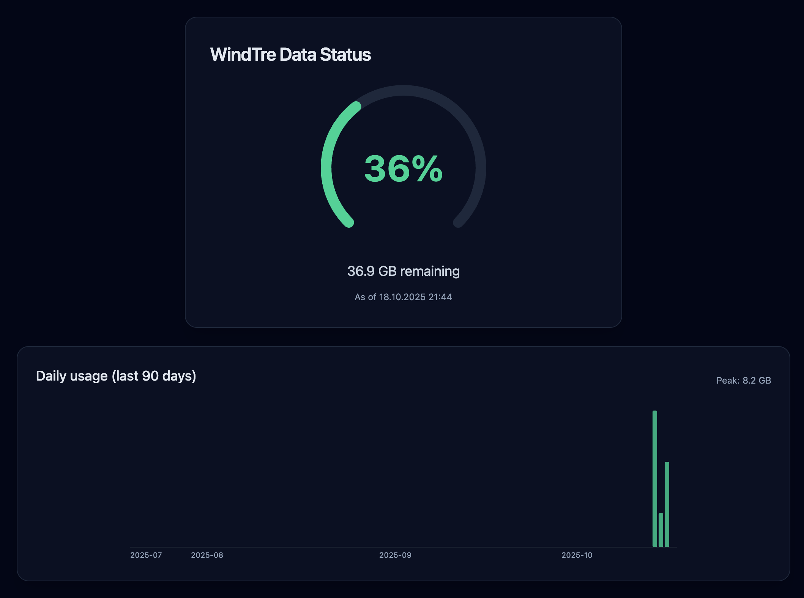

# trullo-rs

A data usage monitor for WindTre mobile plans, built with Rust and Dioxus.
Works by sending SMS from a MikroTik router to fetch data usage status messages.

99% vibe coded with GPT-5 🙈



### Develop

#### Tailwind
1. Install npm: https://docs.npmjs.com/downloading-and-installing-node-js-and-npm
2. Install the Tailwind CSS CLI: https://tailwindcss.com/docs/installation
3. Run the following command in the root of the project to start the Tailwind CSS compiler:

```bash
npx tailwindcss -i ./tailwind.css -o ./assets/tailwind.css --watch
```

#### Run dev server
Run the following command in the root of your project to start developing with the default platform:

```bash
dx serve --platform web
```

## Commands (server feature)

This project also exposes a couple of CLI commands when built with the `server` feature. These commands interact with a local SQLite database and, for `import-sms`, a MikroTik router.

### Environment variables for MikroTik (import-sms)

`import-sms` needs access to your MikroTik’s REST API. Configure one of the following auth methods via environment variables (a `.env` file is supported):

- Required:
	- `MIKROTIK_URL` (e.g., `http://192.168.88.1`)
- Authentication (choose one):
	- `MIKROTIK_AUTH_BASE64` (contents of `base64(username:password)`)
	- or `MIKROTIK_USER` and `MIKROTIK_PASSWORD` (or `MIKROTIK_PASS`)

Example `.env`:

```env
MIKROTIK_URL=http://192.168.88.1
MIKROTIK_USER=admin
MIKROTIK_PASSWORD=yourpassword
# DATABASE_URL=sqlite:///absolute/path/to/data.db?mode=rwc
```

### Commands

- `gen-test-data [PLAN_TOTAL_MB]`
	- Generates ~90 days of synthetic readings to the SQLite DB.
	- `PLAN_TOTAL_MB` is optional (default: `102400` which is ~100 GB).
	- Example:
		```bash
		target/debug/trullo-rs gen-test-data 204800
		```

- `import-sms`
	- Fetches all SMS from the MikroTik inbox, parses WindTre data status messages, and inserts them into the DB.
	- Duplicate records are ignored (uniqueness by timestamp).
	- Example:
		```bash
		# Ensure .env contains MikroTik and optional DATABASE_URL
		target/debug/trullo-rs import-sms
		```

Tips:
- Both commands respect a `.env` file in the project root (via `dotenvy`).
- Run with `RUST_LOG` or check stderr for progress messages.


## release

### docker
```bash
podman build -t trullo-rs .
```

#### builx
```bash
docker buildx build --platform linux/arm64 -t localhost/trullo-rs:latest .

scp trullo-rs_arm64.tar.gz ubuntu@pi:/tmp/
ssh ubuntu@pi
gunzip -c /tmp/trullo-rs_arm64.tar.gz | sudo podman load
# or
docker save localhost/trullo-rs:latest | ssh ubuntu@pi 'sudo podman load'
```


### direct

Build the server and client bundle

```bash
dx bundle --platform web --release 
```

Setting the arch or compiling for another target is not supported.

```bash
MIKROTIK_URL=http://192.168.88.1 MIKROTIK_USER=admin MIKROTIK_PASSWORD=password DATABASE_URL=/home/ubuntu/trullo-rs/data.db IP=0.0.0.0  ./trullo-rs --port 8080
```